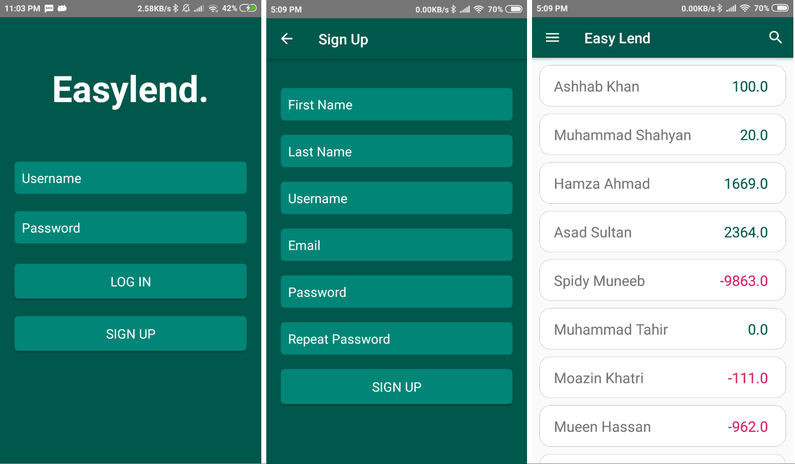
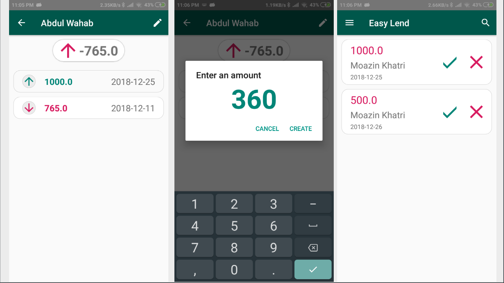

# EasyLend
An app that lets friends keep track of their money exchange with each other. [A work in progress]

## Screenshots

## Important Points

- Right now it treats all users as friends with each other. The concept of groups needs to be added very soon.
- In order for the app to work the server side needs to be deployed and appropriate address needs to be inserted in `strings.xml` file. Server side is [here](https://github.com/moazin/easylend-server). 